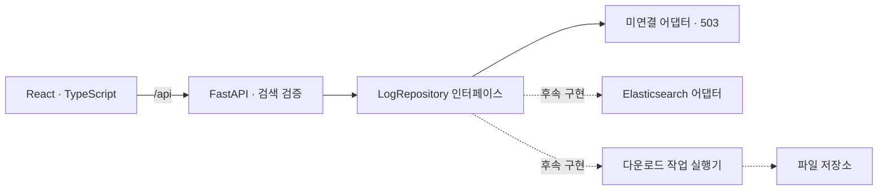

# 구조 및 데이터 연동

## 현재 경계

화면에 데이터 미연결 상태와 실제 검색 결과 없음 상태를 구분합니다. 메타데이터의 시스템·Fab 목록은 빈 배열이며, 운영 환경의 값을 추측하지 않습니다. `/api/health`는 API 프로세스 상태이고 `/api/metadata`가 데이터 소스 연결 상태를 나타냅니다.

프런트엔드 상대 기간은 요청 직전에 절대 UTC 시각으로 변환합니다. 화면과 텍스트 입력의 기본 시간대는 KST입니다. 명시적인 `Z` 또는 UTC 오프셋도 입력할 수 있습니다. 서버는 timezone이 있는 시각만 받습니다. 최근 7일 조회 프리셋에는 요청 전달 시간을 위한 1초 여유가 있으며, 오래된 절대 기간은 다시 입력해야 합니다.

## Acell / ARC 화면 디자인

참고 원본은 `/home/sy_jin/WeshBoard`이며 수정하지 않습니다. 실제 컴포넌트의 CSS import와 클래스 사용을 확인한 아래 항목만 선별했습니다.

| 참고 위치                                                                                 | 확인한 스타일                                                                         | 적용 대상                                |
| ----------------------------------------------------------------------------------------- | ------------------------------------------------------------------------------------- | ---------------------------------------- |
| `src/index.css`                                                                           | 배경 `#eef1f5`, 테두리 `#d8dde5`, 주황 `#e25822`, 호버 `#c54a18`, 선택 배경 `#fbe7dc` | 화면 전용 디자인 변수                    |
| `src/pages/master/MasterPanelFrame.tsx`, `MasterDashboard.css`, `MasterDashboardTabs.css` | 흰 패널, 8px 모서리, 얇은 테두리, 패널 그림자, 제목과 본문 구분                       | 검색 / 결과 / 로그 상세 패널과 조회창 탭 |
| `src/pages/analysis/ComparisonAnalysis.tsx`, `ComparisonAnalysis.css`                     | 주황 선택 상태, 선택창 너비에 맞춘 팝업, 224px 내부 스크롤, Lucide 아이콘             | 버튼 / 배치 선택 / 드롭다운              |
| `src/pages/auth/AiSettingsSection.tsx`, `Admin.css`                                       | 라벨과 폼의 간격, 포커스 테두리, 선택된 설정 카드                                     | 검색 입력과 다운로드 형식 선택           |
| `src/components/agent/AgentWidget.tsx`, `AgentWidget.css`, `src/App.css`                  | 본문 14px 이상과 충분한 행간, 답변 표의 배경과 테두리, 내부 스크롤                    | 로그 본문과 Key / Value 상세             |

구현은 `frontend/src/log-design.css`의 `.log-design` 하위로 제한합니다. Acell / ARC 화면과 여기서 여는 대화상자에 적용하며, 다운로드 목록 / 저장조건 목록 / 연결 상태 페이지의 디자인과 메뉴 구조는 유지합니다. 버튼과 입력은 42px 높이, 입력 글씨는 16px, 검색 라벨과 결과 컬럼은 14px 이상입니다. 아이콘은 비교 분석 화면에서도 사용 중인 Lucide로 통일합니다. 기존 요구사항인 동일 트랜잭션 분홍색 / 선택 값 노란색 강조는 별도의 의미 표시로 유지합니다.

`SelectField`는 브라우저 Popover API로 패널 잘림을 피하고 트리거 너비와 화면 안의 위치를 유지합니다. 긴 목록 내부 스크롤, 방향키 / Home / End / Enter / Escape / Tab 및 입력 문자 탐색을 지원합니다. 데이터 조회 / 검색 API 로직은 변경하지 않습니다.

## API 계약

| 경로                        | 역할                             | 현재 응답                      |
| --------------------------- | -------------------------------- | ------------------------------ |
| `GET /api/health`           | 프로세스 상태                    | 200                            |
| `GET /api/metadata`         | 데이터 연결 상태와 코드 목록     | 200, unconfigured, 빈 목록     |
| `POST /api/logs/search`     | 기간·조건·cursor 통합 검색       | 잘못된 요청 422, 유효 요청 503 |
| `POST /api/exports`         | 검색조건을 고정한 파일 생성 작업 | 잘못된 요청 422, 유효 요청 503 |
| `GET /api/exports/{job_id}` | 작업 상태                        | 503                            |

응답 모델·모든 필드 정의는 FastAPI의 `/api/docs` 및 `backend/app/models.py`에 있습니다. 프런트엔드가 임의 인덱스나 raw query를 보내지 않습니다. 검색 필터는 리스트 내부 OR, 필드 간 AND, `all_terms` 내부 AND, `any_terms` 내부 OR로 해석할 계약입니다. 실제 ES 쿼리 생성은 미구현입니다.

검색과 내보내기 요청은 `program: acell | arc`로 프로그램을 구분합니다. `program`을 생략한 기존 요청은 Acell로 취급합니다. 화면은 해당 프로그램의 필드만 값으로 전달하고 서버는 다른 프로그램 전용 필드가 채워진 요청을 거절합니다. System 전체 조회에는 Acell의 G 트랜잭션 ID 또는 ARC의 트랜잭션 키가 필요합니다. ARC 키의 시스템 간 유일성과 실제 G ID 매핑은 후속 확인 사항입니다. `correlate` 옵션은 ARC에만 제공합니다.

앱은 각 프로그램의 `ProgramWorkspace`를 유지하며 왼쪽 메뉴로 노출을 전환합니다. 프로그램별 최대 4개 `Workspace`가 검색·결과·상세 상태를 각각 소유합니다. 메뉴 전환은 상태를 초기화하지 않으며, 새로고침 시에는 명시적으로 저장된 조건만 복원할 수 있습니다. 새 창 링크의 `program` 값으로 해당 프로그램을 열고, 연관검색 링크에는 ID와 기간을 함께 전달합니다.

요청당 최대 1,000행, 배열당 최대 100개 검색어를 받습니다. 서버에서 허용된 System → index 매핑과 사용자 권한을 적용해야 합니다. `System 전체`가 모든 ES 인덱스 접근을 의미하지 않습니다.

## 실제 조회 연결 순서

1. 실제 매핑과 접근 정책을 확인해 정상화된 `LogRecord`로 변환하는 어댑터를 구현합니다.
2. Fab/System/Process/Core·Biz/로그 종류 메타데이터를 실제 허용 범위로 반환합니다.
3. 기간·필드별 토큰을 쿼리로 변환하고 단일 시스템 및 교차 시스템 검색을 연결합니다.
4. 연관검색은 제한된 기간 안에서 일치한 트랜잭션 키를 수집한 뒤 관련 로그를 조회합니다. 1,000행 페이지의 키만 사용하면 전체 연관검색이 아니므로 키 수집 단계에도 별도 페이지 처리가 필요합니다.
5. ARC는 트랜잭션 키로 전체 로그 탭을 조회합니다. Acell은 S/E/G 상세 탭을 제공하며 S/E 탭은 각 ID로 추가 제한합니다. Acell의 G ID가 있으면 함께 좁히고 없으면 선택 행 시스템 범위를 유지합니다. 실제 관계와 교차 시스템 키 범위는 매핑 확인 후 검증합니다.
6. 조건·정렬·PIT 정보를 서버가 보관하거나 검증 가능한 커서로 관리합니다. 조건이 다른 요청에 커서를 재사용할 수 없게 해야 합니다.

Elasticsearch 공식 문서는 10,000건을 넘는 일관된 페이지 조회에 `search_after`와 PIT 조합을 안내합니다. 이에 따라 초기 계약은 커서 기반 이전/다음 이동을 사용합니다. 임의 페이지 점프는 커서 색인·캐시 정책 결정 후 추가할 수 있습니다. [Elasticsearch 페이지 조회 문서](https://www.elastic.co/docs/reference/elasticsearch/rest-apis/paginate-search-results)

현재 커서는 스키마상 문자열 슬롯이며, 실제 PIT 생성·해제, 만료 처리, 정렬의 동률 구분자, total의 정확도는 어댑터 작업입니다. 서버 메모리에 전체 로그를 적재하거나 브라우저에 전체 기간 결과를 한 번에 보내지 않는 방향입니다.

## 대용량 다운로드 후속 설계

조회와 다운로드는 같은 검색조건을 사용하되 별도 경로로 실행합니다. `POST /api/exports`의 성공 계약은 202와 작업 ID이며, 실제 작업 실행기가 없는 현재는 503입니다.

제안 흐름은 `queued → running → completed / failed / cancelled`입니다. 실행기는 기간·사용자 권한을 고정하고 배치 조회하여 파일에 순차 기록합니다. 실제 큐, 파일 저장, 동시 실행 제한, 재시도, 취소 API는 아직 구현하지 않았습니다.

작업 조회 응답의 `download_url`은 후속 `GET /api/exports/{job_id}/file` 경로로 제한하는 화면 구조입니다. 해당 파일 API는 작업 실행기와 함께 구현해야 하며 작업 소유자 검증·만료 파일 삭제·CSV 수식 처리·XLSX 행 한도 분할 정책도 정해야 합니다. 현재 다운로드 목록은 열린 앱 세션 동안만 유지되며 서버 작업 목록 API·자동 폴링은 후속 단계입니다.

수백 MB 실제 로그로 타임아웃·메모리·다운로드 중단·재시도·파일 건수 일치를 검증하기 전에는 대용량 문제 해결을 완료로 간주하지 않습니다.

## Kibana Vega 검토

2026-10-01 확인한 공식 문서에 따르면 Vega는 Kibana 기간 및 필터를 사용하는 사용자 정의 시각화와 여러 데이터 소스를 지원하지만 테이블을 지원하지 않습니다. 따라서 기존 LMS의 테이블·선택·우클릭·창 관리 재현에는 직접적인 대체가 어렵다는 판단입니다. [Elastic Vega 문서](https://www.elastic.co/docs/explore-analyze/visualize/custom-visualizations-with-vega)

텍스트 마크를 표처럼 배치하는 별도 시도는 가능성을 검토할 수 있으나, 운영 테이블의 접근성·스크롤·선택·대용량 파일 생성 문제를 해결했다는 의미는 아닙니다. 이번에는 React 테이블 프레임을 구축하고, Kibana 안에서만 제공해야 할 경우에는 고객 버전의 Discover·데이터 테이블·Reporting 가능 범위를 별도 PoC로 확인합니다. Vega 화면 안에 다운로드 작업 실행기를 구현하는 설계는 이번 범위에 포함하지 않습니다.

## 개발·운영 구분

- 개발 서버는 localhost에 바인딩하고 프런트엔드가 `/api`를 프록시합니다. 외부 CDN 폰트·이미지·웹 서비스를 사용하지 않습니다.
- 운영 서버·컨테이너·리버스 프록시·TLS·SSO·사용자별 권한은 미구현입니다.
- 비밀값이나 원본 운영 로그는 공개 저장소에 넣지 않습니다. 환경파일은 Git에서 제외됩니다.
- localStorage 저장은 사용자가 명시적으로 저장한 검색조건에만 적용합니다. 계정 간 동기화는 없습니다.
- XML·SQL·JSON은 표시용 정렬이며 원문 메시지를 바꾸지 않습니다. HTML로 렌더링하지 않습니다. 원문 저장과 현재 표시 복사를 구분합니다.
