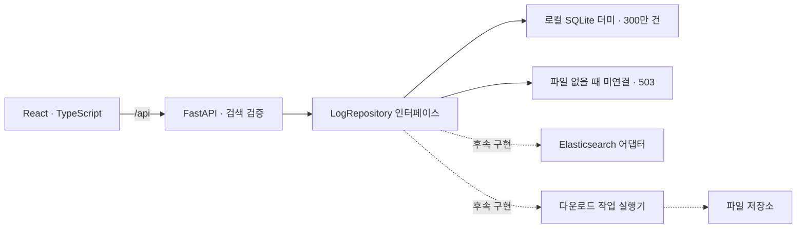

# 구조 및 데이터 연동

## 현재 경계

화면에 데이터 미연결 상태와 실제 검색 결과 없음 상태를 구분합니다. 더미 소스는 개발용 시스템·Fab 목록을 반환하고, 미연결 상태에서는 빈 배열을 반환합니다. 운영 코드표로 간주하지 않습니다. `/api/health`는 API 프로세스 상태이고 `/api/metadata`가 데이터 소스 연결 상태를 나타냅니다.

프런트엔드 상대 기간은 요청 직전에 절대 UTC 시각으로 변환합니다. 화면과 텍스트 입력의 기본 시간대는 KST입니다. 명시적인 `Z` 또는 UTC 오프셋도 입력할 수 있습니다. 서버는 timezone이 있는 시각만 받습니다. 최근 7일 조회 프리셋에는 요청 전달 시간을 위한 1초 여유가 있으며, 오래된 절대 기간은 다시 입력해야 합니다.

## Acell / ARC 화면 디자인

참고 원본은 `/home/sy_jin/WeshBoard`이며 수정하지 않습니다. 실제 컴포넌트의 CSS import와 클래스 사용을 확인한 아래 항목만 선별했습니다.

| 참고 위치                                                                                 | 확인한 스타일                                                                         | 적용 대상                                |
| ----------------------------------------------------------------------------------------- | ------------------------------------------------------------------------------------- | ---------------------------------------- |
| `src/index.css`                                                                           | 배경 `#eef1f5`, 테두리 `#d8dde5`, 주황 `#e25822`, 호버 `#c54a18`, 선택 배경 `#fbe7dc` | 화면 전용 디자인 변수                    |
| `src/pages/master/MasterPanelFrame.tsx`, `MasterDashboard.css`, `MasterDashboardTabs.css` | 흰 패널, 8px 모서리, 얇은 테두리, 패널 그림자, 제목과 본문 구분                       | 검색 / 결과 / 로그 상세 패널과 조회창 탭 |
| `src/pages/analysis/ComparisonAnalysis.tsx`, `ComparisonAnalysis.css`                     | 주황 선택 상태, 선택창 너비에 맞춘 팝업, 224px 내부 스크롤, Lucide 아이콘             | 버튼 / 배치 선택 / 드롭다운              |
| `src/pages/auth/AiSettingsSection.tsx`, `Admin.css`                                       | 라벨과 폼의 간격, 포커스 테두리, 선택된 설정 카드                                     | 검색 입력과 다운로드 형식 선택           |
| `src/components/agent/AgentWidget.tsx`, `AgentWidget.css`, `src/App.css`                  | 본문 14px 이상과 충분한 행간, 답변 표의 배경과 테두리, 내부 스크롤                    | 로그 본문과 Key / Value 상세             |

최신 색상 지시에 따라 강조색은 사용자가 첨부한 SK hynix 로고의 빨강 / 주황 톤으로 조정했습니다. 주 동작과 선택 상태는 `#ea002c`, 섹션 아이콘과 보조 강조는 `#f58220`을 사용하며, WeshBoard에서 참고한 패널 구조와 간격은 유지합니다.

구현은 `frontend/src/log-design.css`의 `.log-design` 하위로 제한합니다. Acell / ARC와 다운로드 목록 / 저장조건 목록 / 연결 상태에 같은 디자인을 적용하고 메뉴 구조는 유지합니다. 버튼과 입력은 42px 높이, 입력 글씨는 16px, 검색 라벨과 결과 컬럼은 14px 이상입니다. 아이콘은 비교 분석 화면에서도 사용 중인 Lucide로 통일합니다. 두 프로그램 모두 동일 트랜잭션명의 행은 분홍, 선택한 단일 셀은 노랑으로 표시합니다. 두 색상은 사용자가 각각 변경할 수 있습니다. 행 강조는 빈 이름을 제외한 `transaction_name.trim()` 비교이며 ID나 키에 의존하지 않습니다. 셀 강조는 로그 ID와 컬럼으로 한 셀만 식별하며 페이지 이동 시 보존합니다. No 클릭은 셀 강조를 해제하며 조회 조건 변경은 전체 선택을 초기화합니다.

`SelectField`는 브라우저 Popover API로 패널 잘림을 피하고 트리거 너비와 화면 안의 위치를 유지합니다. 긴 목록 내부 스크롤, 방향키 / Home / End / Enter / Escape / Tab 및 입력 문자 탐색을 지원합니다. 데이터 조회 / 검색 API 로직은 변경하지 않습니다.

## API 계약

| 경로                        | 역할                             | 현재 응답                                     |
| --------------------------- | -------------------------------- | --------------------------------------------- |
| `GET /api/health`           | 프로세스 상태                    | 200                                           |
| `GET /api/metadata`         | 데이터 연결 상태와 코드 목록     | 더미 DB 존재 시 connected + dummy + 코드 목록 |
| `POST /api/logs/search`     | 기간·조건·cursor 통합 검색       | 잘못된 요청 422, 더미 검색 200, 미연결 503    |
| `POST /api/exports`         | 검색조건을 고정한 파일 생성 작업 | 잘못된 요청 422, 더미 소스 501, 미연결 503    |
| `GET /api/exports/{job_id}` | 작업 상태                        | 더미 소스 501, 미연결 503                     |

응답 모델·모든 필드 정의는 FastAPI의 `/api/docs` 및 `backend/app/models.py`에 있습니다. 프런트엔드가 임의 인덱스나 raw query를 보내지 않습니다. 검색 필터는 리스트 내부 OR, 필드 간 AND, `all_terms` 내부 AND, `any_terms` 내부 OR로 해석할 계약입니다. 실제 ES 쿼리 생성은 미구현입니다.

검색과 내보내기 요청은 `program: acell | arc`로 프로그램을 구분합니다. `program`을 생략한 기존 요청은 Acell로 취급합니다. 화면은 해당 프로그램의 필드만 값으로 전달하고 서버는 다른 프로그램 전용 필드가 채워진 요청을 거절합니다. System 전체 조회에는 Acell의 G 트랜잭션 ID 또는 ARC의 트랜잭션 키가 필요합니다. ARC 키의 시스템 간 유일성과 실제 G ID 매핑은 후속 확인 사항입니다. `correlate` 옵션은 ARC에만 제공합니다.

앱은 각 프로그램의 `ProgramWorkspace`를 유지하며 왼쪽 메뉴로 노출을 전환합니다. 프로그램별 최대 4개 `Workspace`가 검색·결과·상세 상태를 각각 소유합니다. 메뉴 전환은 상태를 초기화하지 않으며, 새로고침 시에는 명시적으로 저장된 조건만 복원할 수 있습니다. 새 창 링크의 `program` 값으로 해당 프로그램을 열고, 연관검색 링크에는 ID와 기간을 함께 전달합니다.

요청당 최대 1,000행, 배열당 최대 100개 검색어를 받습니다. 서버에서 허용된 System → index 매핑과 사용자 권한을 적용해야 합니다. `System 전체`가 모든 ES 인덱스 접근을 의미하지 않습니다.

## 로컬 더미 어댑터

`backend/app/dummy_data.py`가 300만 행과 시간·시스템·G/E/S·ARC 키 인덱스를 생성합니다. 파일 존재 시 `DummyRepository`가 선택되며 `Metadata.source_kind=dummy`와 실제 저장 건수/시각 범위를 전달합니다. 파일이 없거나 `Y17_LOG_SOURCE=unconfigured`이면 기존 미연결 동작을 유지합니다.

검색은 SQLite 읽기 전용 연결을 사용하고 `asyncio.to_thread`에서 실행합니다. 조건은 바인딩하고 컬럼은 허용 목록으로 제한합니다. `(정렬 값, id)` 키셋 커서에 정렬·필터·조건/데이터셋 해시와 HMAC을 포함해 변경된 검색이나 교체 전 데이터셋 커서를 거절합니다. 커서는 최초 응답부터 15분 동안 같은 기간을 고정하며 `current_cursor`로 첫 페이지도 다시 조회할 수 있습니다. 직접 페이지 이동은 커서의 위치가 목적 페이지와 일치하면 키셋을 사용하고, 방문하지 않은 페이지는 ID만 정렬한 OFFSET 조회 후 해당 페이지 원문을 읽습니다. 전체 건수와 강조 집계를 각각 최대 64개씩 캐시합니다. 쿼리가 30초를 넘으면 SQLite 진행 핸들러로 중단하고 조회 범위 축소를 안내합니다.

ARC 연관검색은 전체 1차 결과의 키를 서브쿼리로 추출한 후 같은 기간 내 모든 연관 시스템의 로그를 조회합니다. 페이징은 확장된 결과에 적용합니다. MSG 조건은 대소문자를 구분하지 않는 문자 포함 검색이며 Full Text의 유사검색/형태소 분석은 구현하지 않습니다. SQLite 검증 결과는 운영 Elasticsearch의 성능 보장을 의미하지 않습니다.

전체 로그 다운로드는 연결하지 않았으므로 `exports_available=false`, 요청 시 `501 EXPORT_NOT_AVAILABLE`을 반환합니다. 기존 상세 탭의 현재 불러온 로그 저장은 사용할 수 있습니다. 생성 DB는 Git에 포함하지 않습니다. 생성/갱신 절차와 데이터 규칙은 [더미 데이터](dummy-data.md)를 참고하세요.

검색 요청의 `sort`, `page`, `highlight`, `highlight_mode`, `count_only`가 결과 화면을 제어합니다. 컬럼은 고정 허용 목록을 사용하고 값은 SQL 파라미터로 바인딩합니다. `highlight_mode`는 전체/동일 이름/단일 선택 셀의 행/두 강조의 합집합을 구분합니다. `count_only`는 전체 원래 검색범위에서 집계만 반환하며, `base_total`과 `total_pages`로 필터 전 건수와 결과 페이지 수를 구분합니다. S/E/G 상세 조회에서는 이 화면 필터를 제거합니다.

브라우저는 고정 높이 44px 행을 최대 30개 렌더링하며 나머지 영역은 스크롤 공간으로 유지합니다. 검색조건이 바뀌면 페이지 캐시를 비우고 최대 6페이지, 14분 이내 응답만 재사용합니다. 날짜 포맷은 페이지 응답마다 한 번 계산하며, 선택 집계 요청은 150ms 지연 후 전송하고 이전 응답은 취소합니다.

검증은 `Y17_TEST_LOCAL_API=1`과 `Y17_TEST_BUILD_DIR`로 TestClient와 별도 빌드를 브라우저에 연결할 수 있습니다. 이 방식은 포트를 열거나 사용자가 실행한 서버를 시작·종료하지 않습니다.

## 실제 조회 연결 순서

1. 실제 매핑과 접근 정책을 확인해 정상화된 `LogRecord`로 변환하는 어댑터를 구현합니다.
2. Fab/System/Process/Core·Biz/로그 종류 메타데이터를 실제 허용 범위로 반환합니다.
3. 기간·필드별 토큰을 쿼리로 변환하고 단일 시스템 및 교차 시스템 검색을 연결합니다.
4. 연관검색은 제한된 기간 안에서 일치한 트랜잭션 키를 수집한 뒤 관련 로그를 조회합니다. 1,000행 페이지의 키만 사용하면 전체 연관검색이 아니므로 키 수집 단계에도 별도 페이지 처리가 필요합니다.
5. ARC는 트랜잭션 키로 전체 로그 탭을 조회합니다. Acell은 S/E/G 상세 탭을 제공하며 S/E 탭은 각 ID로 추가 제한합니다. Acell의 G ID가 있으면 함께 좁히고 없으면 선택 행 시스템 범위를 유지합니다. 실제 관계와 교차 시스템 키 범위는 매핑 확인 후 검증합니다.
6. 조건·정렬·PIT 정보를 서버가 보관하거나 검증 가능한 커서로 관리합니다. 조건이 다른 요청에 커서를 재사용할 수 없게 해야 합니다.

Elasticsearch 공식 문서는 10,000건을 넘는 일관된 페이지 조회에 `search_after`와 PIT 조합을 안내합니다. 이에 따라 초기 계약은 커서 기반 이전/다음 이동을 사용합니다. 더미 어댑터의 번호 이동은 구현했으며, 운영 어댑터에서는 별도의 커서 색인·캐시 정책으로 구현해야 합니다. [Elasticsearch 페이지 조회 문서](https://www.elastic.co/docs/reference/elasticsearch/rest-apis/paginate-search-results)

현재 커서는 스키마상 문자열 슬롯이며, 실제 PIT 생성·해제, 만료 처리, 정렬의 동률 구분자, total의 정확도는 어댑터 작업입니다. 서버 메모리에 전체 로그를 적재하거나 브라우저에 전체 기간 결과를 한 번에 보내지 않는 방향입니다.

## 대용량 다운로드 후속 설계

조회와 다운로드는 같은 검색조건을 사용하되 별도 경로로 실행합니다. `POST /api/exports`의 성공 계약은 202와 작업 ID이며, 실제 작업 실행기가 없는 현재는 503입니다.

제안 흐름은 `queued → running → completed / failed / cancelled`입니다. 실행기는 기간·사용자 권한을 고정하고 배치 조회하여 파일에 순차 기록합니다. 실제 큐, 파일 저장, 동시 실행 제한, 재시도, 취소 API는 아직 구현하지 않았습니다.

작업 조회 응답의 `download_url`은 후속 `GET /api/exports/{job_id}/file` 경로로 제한하는 화면 구조입니다. 해당 파일 API는 작업 실행기와 함께 구현해야 하며 작업 소유자 검증·만료 파일 삭제·CSV 수식 처리·XLSX 행 한도 분할 정책도 정해야 합니다. 현재 다운로드 목록은 열린 앱 세션 동안만 유지되며 서버 작업 목록 API·자동 폴링은 후속 단계입니다.

수백 MB 실제 로그로 타임아웃·메모리·다운로드 중단·재시도·파일 건수 일치를 검증하기 전에는 대용량 문제 해결을 완료로 간주하지 않습니다.

## Kibana Vega 검토

2026-10-01 확인한 공식 문서에 따르면 Vega는 Kibana 기간 및 필터를 사용하는 사용자 정의 시각화와 여러 데이터 소스를 지원하지만 테이블을 지원하지 않습니다. 따라서 기존 LMS의 테이블·선택·우클릭·창 관리 재현에는 직접적인 대체가 어렵다는 판단입니다. [Elastic Vega 문서](https://www.elastic.co/docs/explore-analyze/visualize/custom-visualizations-with-vega)

텍스트 마크를 표처럼 배치하는 별도 시도는 가능성을 검토할 수 있으나, 운영 테이블의 접근성·스크롤·선택·대용량 파일 생성 문제를 해결했다는 의미는 아닙니다. 이번에는 React 테이블 프레임을 구축하고, Kibana 안에서만 제공해야 할 경우에는 고객 버전의 Discover·데이터 테이블·Reporting 가능 범위를 별도 PoC로 확인합니다. Vega 화면 안에 다운로드 작업 실행기를 구현하는 설계는 이번 범위에 포함하지 않습니다.

## 개발·운영 구분

- 개발 서버는 localhost에 바인딩하고 프런트엔드가 `/api`를 프록시합니다. 외부 CDN 폰트·이미지·웹 서비스를 사용하지 않습니다.
- 운영 서버·컨테이너·리버스 프록시·TLS·SSO·사용자별 권한은 미구현입니다.
- 비밀값이나 원본 운영 로그는 공개 저장소에 넣지 않습니다. 환경파일은 Git에서 제외됩니다.
- localStorage 저장은 사용자가 명시적으로 저장한 검색조건에만 적용합니다. 계정 간 동기화는 없습니다.
- XML·SQL·JSON은 표시용 정렬이며 원문 메시지를 바꾸지 않습니다. HTML로 렌더링하지 않습니다. 원문 저장과 현재 표시 복사를 구분합니다.

## 조회 성능 개선 (2026-10-02)

일반 페이지 요청에는 강조 집계를 포함하지 않고, 선택 시 별도 집계합니다. 페이지 이동·정렬만으로 같은 집계를 반복하지 않습니다. 트랜잭션 집계 캐시는 선택 셀과 독립적이며 셀은 로그 ID로 한 행만 확인합니다. 같은 트랜잭션 안의 선택 셀은 합집합 조회에서 중복 조건을 제거합니다.

단일 시스템의 넓은 조회에는 `(system, trim(transaction_name), id, time_us)` 인덱스를 사용합니다. 좁은 기간은 기존 시간 인덱스를 유지합니다. 생성기는 인덱스를 포함하며 기존 DB는 `npm run data:optimize`로 데이터 재생성 없이 추가할 수 있습니다. 인덱스가 없는 파일도 기존 조회 방식으로 동작합니다.

현재 로컬 300만 행에서 MES 전체 75만 행, 페이지당 1,000행을 측정했습니다. 같은 프로세스에서 기본 건수 캐시를 준비한 뒤 트랜잭션명 오름차순 정렬은 약 1,580ms → 25ms, 최초 강조 집계는 1,269ms → 34ms, 집계 재사용은 1ms였습니다. API 내부 처리 측정이며 네트워크·브라우저 렌더링 시간이나 다른 조건의 성능을 보장하는 수치는 아닙니다.

## 날짜·시간 입력 정밀도

달력은 브라우저의 `datetime-local` 대신 공통 디자인의 팝오버를 사용합니다. 시(00~23)·분·초(00~59)·밀리초(ms, 000~999의 3자리)를 각각 표시하고 날짜나 시간을 수정하면 즉시 반영합니다. 각 입력칸 위의 순환 스크롤 선택기는 휠·드래그·터치·방향키를 지원하며 23→00, 59→00처럼 끝에서 처음으로 이어집니다. 직접 입력도 유지합니다. 밀리초도 999→000으로 순환하며 선택기는 주변 5개 값만 표시합니다. 오전·오후 선택은 없으며, 화면은 KST를 사용합니다.

화면의 시간 표시·입력·기간 비교 및 API 검색 요청은 밀리초(소수점 3자리)를 사용합니다. 이전에 저장한 9자리 검색조건을 불러올 때는 첫 3자리만 유지합니다. API의 기존 고정밀 시각 지원은 호환성을 위해 유지하며 원본 로그 데이터는 변경하지 않습니다.
